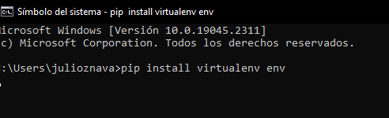

<h2>Instrucciones para la ejecucion del programa</h2>

#### Proyecto en Railway
https://inventario-administracion-production.up.railway.app/

#### Proyecto en Local
http://127.0.0.1:8000/
#### Proyecto en Github
https://github.com/julioznava/Inventario-Administracion

<h3>Cuentas de acceso panel login: </h3>

     login: test
    password: backend.2022
 
<h3>Instrucciones: </h3>

1.  descomprimir el archivo en el escritorio.
2.  abrir una consola en cmd o terminal en linux
3.  instalar virtualenv

**pip install virtualenv env**

    (habilitar virtualenv en el caso que la carpera ENV no se encuentre en el projecto)
    comando= virtualenv env

4. digitar para abrir entorno virtual enviroment

    env\Script\activate

5. instalar django en entorno virtual

    pip install django

6. Realizar makemigrations y migrate

    python manage.py makemigrations
    python manage.py migrate

7. Instalar las librerias necesarias en archivo "requerirements.txt"

    pip install -r requirements.txt

8. Levantar el server

    python manage.py runserver

<h4>Si desea ejecutar la aplicacion en algun IDE o editor de texto, debe realizar lo mismo._ </h4>

<h1>Para la ejecucion de las API</h1>

### EN RAILWAY

 http://inventario-administracion-production.up.railway.app/api

 insumos-computacionales: http://inventario-administracion-production.up.railway.app/api/insumos-computacionales

 insumos-oficina: http://inventario-administracion-production.up.railway.app/api/insumos-oficina

 registro-vehiculos: http://inventario-administracion-production.up.railway.app/api/registro-vehiculos

#### EN LOCAL

http://127.0.0.1:8000/api/

 insumos-computacionales : http://127.0.0.1:8000/api/insumos-computacionales/

 insumos-oficina: http://127.0.0.1:8000/api/insumos-oficina/

 registro-vehiculos: http://127.0.0.1:8000/api/registro-vehiculos/
 